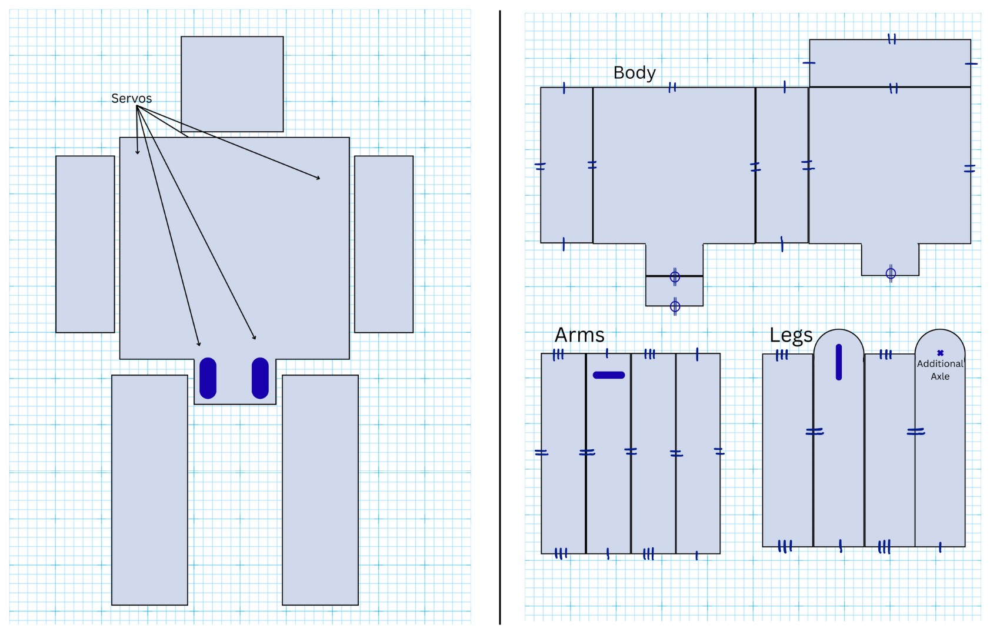

# Cardboard Robot
<!---Replace this text with a brief description (2-3 sentences) of your project. This description should draw the reader in and make them interested in what you've built. You can include what the biggest challenges, takeaways, and triumphs from completing the project were. As you complete your portfolio, remember your audience is less familiar than you are with all that your project entails! --->
<!---
You should comment out all portions of your portfolio that you have not completed yet, as well as any instructions:--->
 
<!--- This is an HTML comment in Markdown -->
<!--- Anything between these symbols will not render on the published site -->


| **Engineer** | **School** | **Area of Interest** | **Grade** |
|:--:|:--:|:--:|:--:|
| Mihika K | Los Altos High School | Mechanical/Electrical Engineering | Incoming Junior

<!---**Replace the BlueStamp logo below with an image of yourself and your completed project. Follow the guide [here](https://tomcam.github.io/least-github-pages/adding-images-github-pages-site.html) if you need help.** --->


  
# Final Milestone

<!---**Don't forget to replace the text below with the embedding for your milestone video. Go to Youtube, click Share -> Embed, and copy and paste the code to replace what's below.**

<iframe width="560" height="315" src="https://www.youtube.com/embed/F7M7imOVGug" title="YouTube video player" frameborder="0" allow="accelerometer; autoplay; clipboard-write; encrypted-media; gyroscope; picture-in-picture; web-share" allowfullscreen></iframe>

For your final milestone, explain the outcome of your project. Key details to include are:
- What you've accomplished since your previous milestone
- What your biggest challenges and triumphs were at BSE
- A summary of key topics you learned about
- What you hope to learn in the future after everything you've learned at BSE --->

<iframe width="560" height="315" src="https://www.youtube.com/embed/0KXFxS0ANo4?si=rPcJuxnakEG7SYnT" title="YouTube video player" frameborder="0" allow="accelerometer; autoplay; clipboard-write; encrypted-media; gyroscope; picture-in-picture; web-share" referrerpolicy="strict-origin-when-cross-origin" allowfullscreen></iframe>

**Description: **
In this milestone, I put together the cardboard body of the robot with its electrical circuit. This circuit includes 2 RGB LEDs, 5 servos controlling the motion of the limbs and head, and 2 sensors: an Ultrasonic Sensor and a Microphone. The robot has three modes, 1) when the Ultrasonic Sensor is activated, 2) when the microphone is activated, and 3) when neither sensor is activated. In the first mode, the Ultrasonic Sensor detects that an object is within 50 centimeters of the robot and responds with red flashing eyes, and sweeping arms. In the second mode, the Microphone detects a sound of significant volume and responds with blue flashing eyes and sweeping arms. In the third mode, the robot is static, with eyes shifting from purple to blue to pink to off.

**Status: **
Each of the components are wired and soldered into the PBC board, and attached to the Arduino Uno. The sensors are activated by excessive sound and proximity, and in turn activate the servos and LED eyes.

**Challenges and Triumphs: **
The biggest challenge I faced at BSE was the problem of getting the robot to walk. In order to allow the robot mobility in its legs, the robot leg was shaped with a semicircle at the top (as shown in the Robot Net). Although it did ensure movement, it also reduced the robot's stability, due there now being only 4 points of contact that balanced the robot's body. When the robot lifted its leg to walk, it furthered reduced stability. In effort to increase its stability, I added a back brace that would ideally increase stability, and take weight off the robot's legs. Although the back brace did increase stability, it also restricted the robot's ability to walk. 

I'm proud of my work on connecting the sensors to the robot's movements. These sensors allow the robot to be an interactive scarecrow, that sensed external factors and move its limbs in response to them. 

**Summary: **
During my time working on the Cardboard Robot, I learned how to construct circuits, considering which components needed a resistor, as well as how Analog and Digital (and PWM) pins worked. I also learned how to code the Arduino and use its libraries (Servo and Ultrasonic) to my advantage. In the future I hope to continue building projects like this one, involving firmware and software to solve small problems.


*Figure 1 - Sensors and Servos Schematic*


# Second Milestone

<iframe width="560" height="315" src="https://www.youtube.com/embed/BYNdLccMI3A?si=dTXreLQWzvdTvkyW" title="YouTube video player" frameborder="0" allow="accelerometer; autoplay; clipboard-write; encrypted-media; gyroscope; picture-in-picture; web-share" referrerpolicy="strict-origin-when-cross-origin" allowfullscreen></iframe>

**Description:**
For this milestone, I have implemented the sensors that will be part of the final Cardboard Robot. Originally, I had intended to make the robot walk, but due to the weight and problems with the robot's balance, I pivoted to adding sensors so the robot can respond to outside inputs. The circuit in the video demonstrates the usage of the Ultrasound Sensor, and the Microphone. The Ultrasound Sensor works by using the process of echolocation. The sensor emits a sound with afrequency of 40 kHz, and measures the time it takes for the sound to be reflected off an object and hit the sensor again. Using the speed of sound, it estimates the distance it is from an object. Note that the speed of sound is about 343 m/s, meaning that this measurement is quite accurate for most moving objects (only planes and rockets can break Mach 1, and they're out of scope for this project). The Microphone works with two inputs, digital and analog, allowing the analysis of the exact volume, as well as whether there is a significant sound or not.

**Status:**
In this particular circuit, the lightbulbs turn on in response to the sensors (red turns on when the Ultrasound Sensor detects an object between 10 and 30 centimeters from it, blue turns on if it detects an object within 10 centimeters, and green turns on in response to a lound sound). Although these lightbulbs won't be in the final robot, the robot will have its own reactions to external stimuli.

**Challenges:**
This milestone required me to consider the specifications of the Ultrasound Sensor, and the Microphone, which I had never used before. The microphone particularly didn't have a lot of documentation online, so I brainstormed how I could analyze the Analog output to differentiate sounds of different levels. By adjusting its sensitivity, I set the microphone so that it could hear detect a person talking.

**Plan:**
I plan on integrating these sensors with the larger robot, so that he can respond to inputs from these sensors. In addition I plan on completing and soldering the circuits.

<iframe width="560" height="315" src="https://www.youtube.com/embed/Wh0m6Htr8E8?si=Qizf5hZY_ph8THIY" title="YouTube video player" frameborder="0" allow="accelerometer; autoplay; clipboard-write; encrypted-media; gyroscope; picture-in-picture; web-share" referrerpolicy="strict-origin-when-cross-origin" allowfullscreen></iframe>

## Sensors Schematic

*Figure 2 - Sensors Schematic*
## Sensors Information

*Figure 3 - Sensors Information*

# First Milestone

<iframe width="560" height="315" src="https://www.youtube.com/embed/EciZOCs-LQc?si=4pNSvlZnDVBJJbzE" title="YouTube video player" frameborder="0" allow="accelerometer; autoplay; clipboard-write; encrypted-media; gyroscope; picture-in-picture; web-share" referrerpolicy="strict-origin-when-cross-origin" allowfullscreen></iframe>

**Description:**
The Smartphone Cardboard Robot is built with servos, LEDs, an electrical circuit, and encased with cardboard blocks. Each of the servos allow the movement of the head, the arms, and legs. LEDs in the head simulate eyes, and will blink in different patterns to indicate different modes. The nets and movement models explain the structure of each cardboard limb as well as the body of the robot. As part of this milestone, I tested the servos and their ability to move the cardboard limbs (see schematics and diagrams below).

**Status:**
As of the first milestone, I have completely built the robot's cardboard body, as well as positioned and attached all the servos. This includes considering movement of the robot's limbs and modifying parts of the body to allow for that. For example, the are actually attached to the body with a semicircle shape at the top allowing it to rotate easily.

**Challenges:**
One challenge I'm facing is the robot's stability. While modifying the legs allowed the robot to actually move its legs, it dramatically reduced the robot's stability due to there only being one point of contact between the legs and the body. Another challenge is considering the placement of the electrical circuit so the robot does not topple.

**Plan:**
Later on, I plan to complete the circuit of the robot with the LEDs, and code the app on the smartphone to control the robot. In addition, I plan on adding a motion sensor and sound sensor so that the robot moves towards motion, and stops at sounds above a certain decibel value.

## Robot Net

*Figure 4 - Robot Net*

## Servos Schematic

*Figure 5 - Servos Schematic*
# Starter Project: RGB Slider

<iframe width="560" height="315" src="https://www.youtube.com/embed/rhV8uBoarpk?si=_rZ5P_-N4F-b0jgd" title="YouTube video player" frameborder="0" allow="accelerometer; autoplay; clipboard-write; encrypted-media; gyroscope; picture-in-picture; web-share" referrerpolicy="strict-origin-when-cross-origin" allowfullscreen></iframe>
**Description:**
The RGB Slider uses three sliders and a lightbulb. Each of the sliders sends an integer value to the lightbulb to determine the color it displays. This is powered with the USB-C plug on the circuit board. Through this project I intended to practice soldering and understand circuits.

**Challenges:**
I intially had problems with the orientation of the lightbulb, since I had placed the negative end in the wrong pin. This meant the circuit didn't work. When I tried to desolder the lightbulb from the circuit board, I was unable to do so, and instead started over from the beginning.

**Summary:**
This project taught me how to build circuits. In addition, I was able to practice soldering, as well as how to check for short circuits with a multimeter and prevent or remove them.

<!---
# Schematics 
Here's where you'll put images of your schematics. [Tinkercad](https://www.tinkercad.com/blog/official-guide-to-tinkercad-circuits) and [Fritzing](https://fritzing.org/learning/) are both great resoruces to create professional schematic diagrams, though BSE recommends Tinkercad becuase it can be done easily and for free in the browser. 

# Code

Here's where you'll put your code. The syntax below places it into a block of code. Follow the guide [here]([url](https://www.markdownguide.org/extended-syntax/)) to learn how to customize it to your project needs. 
```c++
void setup() {
  // put your setup code here, to run once:
  Serial.begin(9600);
  Serial.println("Hello World!");
}

void loop() {
  // put your main code here, to run repeatedly:

}
```

# Bill of Materials
Here's where you'll list the parts in your project. To add more rows, just copy and paste the example rows below.
Don't forget to place the link of where to buy each component inside the quotation marks in the corresponding row after href =. Follow the guide [here]([url](https://www.markdownguide.org/extended-syntax/)) to learn how to customize this to your project needs. 

| **Part** | **Note** | **Price** | **Link** |
|:--:|:--:|:--:|:--:|
| Item Name | What the item is used for | $Price | <a href="https://www.amazon.com/Arduino-A000066-ARDUINO-UNO-R3/dp/B008GRTSV6/"> Link </a> |
| Item Name | What the item is used for | $Price | <a href="https://www.amazon.com/Arduino-A000066-ARDUINO-UNO-R3/dp/B008GRTSV6/"> Link </a> |
| Item Name | What the item is used for | $Price | <a href="https://www.amazon.com/Arduino-A000066-ARDUINO-UNO-R3/dp/B008GRTSV6/"> Link </a> |

# Other Resources/Examples
One of the best parts about Github is that you can view how other people set up their own work. Here are some past BSE portfolios that are awesome examples. You can view how they set up their portfolio, and you can view their index.md files to understand how they implemented different portfolio components.
- [Example 1](https://trashytuber.github.io/YimingJiaBlueStamp/)
- [Example 2](https://sviatil0.github.io/Sviatoslav_BSE/)
- [Example 3](https://arneshkumar.github.io/arneshbluestamp/) --->
## Code for Sensors and Servos (Milestone 3)
```c++
#include <Servo.h>;
#include <HCSR04.h>;
const int LL_PIN = 2;
const int RL_PIN = 8;
const int RA_PIN = 7;
const int LA_PIN = 12;
const int HEAD_PIN = 13;
Servo ll;
Servo la;
Servo rl;
Servo ra;
Servo head;

const int TRIG = 9;
const int ECHO = 5;
float duration, distance;
int sigDistance = 50;
HCSR04 us(TRIG, ECHO);

int micAnalog = A0;
int micDig = 3;
float analogVoltage;

const int PIN_RED = 11;
const int PIN_GREEN = 10;
const int PIN_BLUE = 6;
const int COLOR_INTERVAL = 2000;
int r = 0;
int g = 0;
int b = 0;

int modeRed = 1;
int modeBlue = 2;
int modeHappy = 3;
int ledMode = 0;

bool flagUSsensor = false;
int twelveCycle = 0;
int flag = 0;

unsigned long uSsensorMillis = 0.0;
unsigned long prevMillisColor = 0.0;
unsigned long millisMovement = 0.0;

void setup() {
  ll.attach(LL_PIN);
  la.attach(LA_PIN);
  rl.attach(RL_PIN);
  ra.attach(RA_PIN);
  head.attach(HEAD_PIN);  
  pinMode(micAnalog, INPUT);
  pinMode(micDig,    INPUT);
  pinMode(TRIG,      OUTPUT);
  pinMode(ECHO,      INPUT);
  pinMode(PIN_RED,   OUTPUT);
  pinMode(PIN_GREEN, OUTPUT);
  pinMode(PIN_BLUE,  OUTPUT);

  Serial.begin(9600);
  calibrateServos();
}

void loop() {
  unsigned long currentMillis = millis();
  // Ultrasound Regulation
    distance = us.dist();
    delay(60);
    if (distance < sigDistance){
      Serial.println("FIGHT");
      flag = 1;
      setLED(modeRed);
      sweepArms();
    } else {
      setLED(3);
      flag = 0;
    }

  //mic section
  analogVoltage = analogRead(micAnalog) * (5.0/1023.0);
  Serial.print("Analog Voltage Value: ");
  Serial.println(analogVoltage);
  //refactor for continuous array avgs?
  if (analogVoltage > 1.50 &&  flag != 1){
    r = 0;
    g = 0;
    b = 0;
    setLED(2);
    // if (head.read() != 45){
    //   head.write(45);
    // }
    sweepArms();
  } else {
    if (head.read() != 90){
      head.write(90);
      setLED(3);
    }
  }
  
  //color section
  if (currentMillis - prevMillisColor >= COLOR_INTERVAL){
    prevMillisColor = currentMillis;
    if (ledMode == 0){
      ledMode = 3;
    }
    colorChange(r, g, b);
  }
}

void calibrateServos(){
  ll.write(90);
  rl.write(90);
  ra.write(0);
  la.write(180);
  //head.write(90);
}

void sweepArms(){
  for (int i = 0; i < 4; i++){
    ra.write(180);
    la.write(0);
    delay(500);
    ra.write(0);
    la.write(180);
    delay(500);
  }
  calibrateServos();
}

void redMode(int red, int green, int blue){
  if (red == 0 && green == 0 && blue == 0){
    r = 232;
    g = 33;
    b = 0;
  } else if (red == 232 && green == 33 && blue == 0){
    r = 164;
    g = 16;
    b = 0;
  } else if (red == 164 && green == 16 && blue == 0){
    r = 171;
    g = 255;
    b = 0;
  } else if (red == 171 && green == 255 && blue == 0){
    r = 205;
    g = 0;
    b = 255;
  } else if (red == 205 && green == 0 && blue == 255){
    r = 0;
    g = 0;
    b = 0;
  }
  
  analogWrite(PIN_RED, r);
  analogWrite(PIN_GREEN, g);
  analogWrite(PIN_BLUE, b);
}

void blueMode(int red, int green, int blue){
  if (red == 0 && green == 0 && blue == 0){
    r = 51;
    g = 51;
    b = 255;
  } else if (red == 51 && green == 51 && blue == 255){
    r = 153;
    g = 153;
    b = 255;
  } else if (red = 153 && green == 153 && blue == 255){
    r = 153;
    g = 255;
    b = 255;
  } else {
    r = 0;
    g = 0;
    b = 0;
  }
  analogWrite(PIN_RED, r);
  analogWrite(PIN_GREEN, g);
  analogWrite(PIN_BLUE, b);
}

void happyMode(int red, int green, int blue){
  if (red == 0 && green == 0 && blue == 0){
    r = 255;
    g = 228;
    b = 51;
  } else if (red == 255 && green == 228 && blue == 51){
    r = 255;
    g = 158;
    b = 177;
  } else if (red == 255 && green == 158 && blue == 177){
    r = 102;
    g = 255;
    b = 255;
  } else{
    r = 0;
    b = 0;
    g = 0;
  }
  analogWrite(PIN_RED, r);
  analogWrite(PIN_GREEN, g);
  analogWrite(PIN_BLUE, b);
}

void setLED(int mode){
  ledMode = mode;
}

void colorChange(int red, int green, int blue){
  if (ledMode == modeRed){
    redMode(red, green, blue);
  } else if (ledMode == modeBlue){
    blueMode(red, green, blue);
  } else if (ledMode == modeHappy){
    happyMode(red, green, blue);
  } else {
    r = 0;
    g = 0;
    b = 0;
    analogWrite(PIN_RED, r);
    analogWrite(PIN_BLUE, b);
    analogWrite(PIN_GREEN, g);
  }
}

float findDistance(float duration){
  return duration * (0.0343/2);
}
```
## Code for Servo Testing (Milestone 2)
```c++
#include <Servo.h>

const int LL_PIN = 2;
const int LA_PIN = 4;
const int RL_PIN = 7;
const int RA_PIN = 8;
const int HEAD_PIN = 12;
Servo leftLeg, leftArm, rightArm, rightLeg, head;

void setup() {
  leftLeg.attach(LL_PIN);
  leftArm.attach(LA_PIN);
  rightLeg.attach(RL_PIN);
  rightArm.attach(RA_PIN);
  head.attach(HEAD_PIN);
  reset();
  }

void loop() {
  leftLeg.write(180);
  delay(1000);
  rightLeg.write(0);
  delay(1000);
  leftArm.write(90);
  delay(1000);
  rightArm.write(90);
  head.write(180);
  delay(1000);
  reset();
}

void reset(){
  leftLeg.write(90);
  rightLeg.write(90);
  leftArm.write(0);
  rightArm.write(180); //due to configuration of motors
  head.write(90);
}

```

## Code for Sensor Testing (Milestone 1)
```c++
const int TRIG = 9;
const int ECHO = 6;
const int REDPIN = 13;
const int GREENPIN = 8;
const int BLUEPIN = 12;
int micAnalog = A0;
int micDig = 2;

float analogVoltage;
int digValue;
float duration, distance;

unsigned long prevMillisLow = 0;
unsigned long prevMillisHigh = 0;

void setup() {
  pinMode(micAnalog, INPUT);
  pinMode(micDig, INPUT);
  pinMode(TRIG, OUTPUT);
  pinMode(ECHO, INPUT);
  Serial.begin(9600);
  digitalWrite(REDPIN, LOW);
  digitalWrite(BLUEPIN, LOW);
  digitalWrite(GREENPIN, LOW);
}

void loop() {
  unsigned long currentMillis = millis();
  digitalWrite(TRIG, LOW);
  //replacement for delay-- (2 milliseconds)
  if (currentMillis - prevMillisLow >= 2) {
    prevMillisLow = currentMillis;
    digitalWrite(TRIG, HIGH);
  }
  //replacement for delay-- (10 milliseconds)
  if (currentMillis - prevMillisHigh >= 10) {
    prevMillisHigh = currentMillis;
    digitalWrite(TRIG, LOW);
    duration = pulseIn(ECHO, HIGH);
    distance = (duration*.0343)/2;
    Serial.print("Distance: ");  
	  Serial.println(distance); 

    if (distance < 10){
      digitalWrite(BLUEPIN, HIGH);
      digitalWrite(REDPIN, LOW);
    } else if (distance < 30){
      digitalWrite(REDPIN, HIGH);
      digitalWrite(BLUEPIN, LOW);
    } else {
      digitalWrite(REDPIN, LOW);
      digitalWrite(BLUEPIN, LOW);
    }
  }

  analogVoltage = analogRead(micAnalog) * (5.0/1023.0);
  digValue = digitalRead(micDig);
  Serial.print("Analog Voltage Value: ");
  Serial.println(analogVoltage);
  if (analogVoltage > 0.20){
    digitalWrite(GREENPIN, HIGH);
  } else {
    digitalWrite(GREENPIN, LOW);
  }
}
```

# Bill of Materials
<!--Here's where you'll list the parts in your project. To add more rows, just copy and paste the example rows below.
Don't forget to place the link of where to buy each component inside the quotation marks in the corresponding row after href =. Follow the guide [here]([url](https://www.markdownguide.org/extended-syntax/)) to learn how to customize this to your project needs. -->

| **Part** | **Note** | **Price** | **Link** |
|:--:|:--:|:--:|:--:|
| Recycled Cardboard | Building the body | $0.00 | <a href="https://recyclenation.com/2013/05/cd-recycling-cardboard/"> Link </a> |
| Arduino Uno R3 | Running the robot's code | $27.60 | <a href="https://www.amazon.com/Arduino-A000066-ARDUINO-UNO-R3/dp/B008GRTSV6/"> Link </a> |
| PCB Board | Putting together the circuit | $8.99 | <a href="https://www.amazon.com/EPLZON-Solder-able-Breadboard-Electronics-Compatible/dp/B09WZXHMDG/ref=sxin_17_pa_sp_search_thematic_sspa?content-id=amzn1.sym.59b20fae-6567-4931-bbdf-becb1c92fa78%3Aamzn1.sym.59b20fae-6567-4931-bbdf-becb1c92fa78&crid=1JDCXQ0YKDK5P&cv_ct_cx=pcb%2Bboard&keywords=pcb%2Bboard&pd_rd_i=B09WZXHMDG&pd_rd_r=74861e74-0118-47e9-9f81-d5b2192fd10a&pd_rd_w=8DDL3&pd_rd_wg=NnMZY&pf_rd_p=59b20fae-6567-4931-bbdf-becb1c92fa78&pf_rd_r=42DZG4YG291S17C55VAS&qid=1751990116&sbo=RZvfv%2F%2FHxDF%2BO5021pAnSA%3D%3D&sprefix=pcb%2Bboard%2Caps%2C152&sr=1-3-7efdef4d-9875-47e1-927f-8c2c1c47ed49-spons&sp_csd=d2lkZ2V0TmFtZT1zcF9zZWFyY2hfdGhlbWF0aWM&th=1"> Link </a> |
| 5 Servos | Moving limbs and head | $18.99 | <a href="https://www.amazon.com/Micro-Helicopter-Airplane-Remote-Control/dp/B072V529YD/ref=sr_1_1_sspa?crid=2I9XJYA7DA3TA&dib=eyJ2IjoiMSJ9.38ZhRgCMgVoxhM285L-3303Tss8izxJvOKKvPp_LDxcthsdoueUYmEuTyPZMRjNF_Uy4bccJaRSJCOcJxVLBX2-G0xmiHPjrs0KdriI5surMSTHB8Y4AnqZjbezyJG6D4CGkOMdqYD0J6Jlft0rh53fGpDSuYGGwgH-R5RKfKAlj-0Od2_K4AV6CBnpKEpsw5weerNi5hpRg5qxkwdzSDrzdNkmlVCzu43GR_aE1cjkn4FrnPnEVzQetjz7DDa148pExpslAEgjJGxYtg6LhudrXPC7_bKR0WLTIzQgL3h8.y2J_mIIGiMyN5Nt5-tQ4Leee_KvOux1KAIgtDwtYat4&dib_tag=se&keywords=servo&qid=1751990225&sprefix=servo%2Caps%2C149&sr=8-1-spons&sp_csd=d2lkZ2V0TmFtZT1zcF9hdGY&th=1"> Link </a> |
| 2 RGB LEDS | Controlling Eyes | $8.99 | <a href="https://www.amazon.com/EDGELEC-Tri-Color-Multicolor-Diffused-Resistors/dp/B077XGF3YR/ref=sr_1_3?crid=C94RFCDWSM9G&dib=eyJ2IjoiMSJ9.BU4S0jVgvYFMaG3YX-8kv2Q3-sYvor_0lAaEqXVX7bpJHOg9aklW7u-KvpCjk4iRKn7gLzVMNdvy_gL4fTwFJEqg9UhamERYnW9NCoR-qt_m5CRMXP960zHRAXKmLCkHFCIMVmelan329bXOpAX3P8JWXsoIzNx_gjUDXXW8sFo_XV8uY-JF5cD0ZrfovqInn44vefuAIgSpTWfGkWI-4s9YtL942njLAEFY2nmanOQ.tcg3ffVYpQb5p8cnDE4r9dcXPhId0UyOUFv-_GVgcXw&dib_tag=se&keywords=rgb%2Bleds&qid=1751990265&sprefix=rgb%2Bleds%2Caps%2C143&sr=8-3&th=1"> Link </a> |
| Wires | Attaching circuit | $15.59 | <a href="https://www.amazon.com/TUOFENG-Hookup-Wires-6-Different-Colored/dp/B07V1D82HM/ref=sr_1_1_sspa?crid=1GN51JYMQT3RM&dib=eyJ2IjoiMSJ9.wRTSamftInUyLppGnUno-hZ1_0uafrnJ4sWsJy6qc2G9SqBXoiDCpNcLA4MpAf43d-kVA-VkQg2H7ChVTLytFUNS5O02avIZWLNroVpjT_mxXAzoxy4ATzcyskqdHOKBIPo6gVsFYYM2v5POK7dbkzXVNy8UBjALVn5eYXd37zFJtu10pkuhe6NMka1wQpX9apgtT8RrGjcqZmohxd_Nqgr9Sk58t3YH6-OiCghvV1eTA3tJHaWUYncIivaIQRwW5YxJx3KvUtr5B07NHI4BZqEiny41ahgY5SGgZ5qsV9Y.RcaMOFdi_jxe_1wHrB13PCfsJnGS52Aue90_Z27b5Fw&dib_tag=se&keywords=wires%2Bsolid%2Bcore&qid=1751990406&sprefix=wires%2Bsolid%2Bcore%2Caps%2C146&sr=8-1-spons&sp_csd=d2lkZ2V0TmFtZT1zcF9hdGY&th=1"> Link </a> |
| Ultrasonic Sensor | Detecting how far away an object is | $8.99 | <a href="https://www.amazon.com/ELEGOO-HC-SR04-Ultrasonic-Distance-MEGA2560/dp/B01COSN7O6/ref=sr_1_4?crid=3LGJ5CH4ZRP31&dib=eyJ2IjoiMSJ9.w-v74CMMP9eRh1BFF5BJ6_wkTuX7oE6ByRL7NXHjY_cCyuedPyWbrqpJTYjNpMdsQsF42eVpl2-TVTK19t7z7RevVv2nP4v_Zxl4SGFh-MRgn_ImwK5zE8NgR1SIhqj6gvH10gtCuBMyQ9Bs0gXOYWK3edLtes7Q8xTmHMOQbEGlheII0XJ_lRG2j6Eiqvp6M-tZO4NPb0SO66xut3wIf6PiSuiZQeQ8PsNjHBD7fsQ.l4iqNS5bwviBSMaK40oCBa-QUeTh_fGi-m0TpFVQsQk&dib_tag=se&keywords=ultrasonic+sensor+arduino&qid=1751990474&sprefix=ultrasonic+sensor+arduino%2Caps%2C139&sr=8-4"> Link </a> |
| Microphone | Detecting Excessive Sound | $5.99 | <a href="https://www.amazon.com/MECCANIXITY-Microphone-Sensor-Detection-Voice-Activated/dp/B0DNDRPNYY/ref=sr_1_1?crid=2PHHNO96IFQSI&dib=eyJ2IjoiMSJ9.I78A1zn6QQ4TaCc5rgNBRetP_17U4NOfysQ5PlPS1AyG6Go5TkutaL6KVdGKMmEl55kmDeV-uLp046Kw_m7GiL29L5s6ht01CUX0Yppcl34HyWYhjz-3V0-WlzAvw-f4UN1_7siH9LpouOthEL7yRwTCfuXoFyRIBZ1G24l_QR5TW3P1n6t4-po7LPSLXw4Xw1MD0GoEt9_LPMKj-VZMjz7b8fT8KWnTqxPM1npYa6I.h-kNeLC3geZJUwAYsTQxtyi0VWnNMd_O_p27um8kt5E&dib_tag=se&keywords=KY-038&qid=1751990526&sprefix=ky-038%2Caps%2C143&sr=8-1"> Link </a> |
